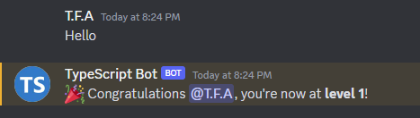
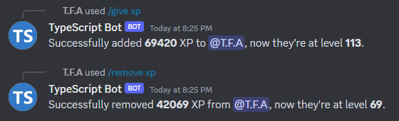
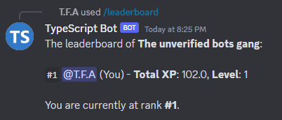
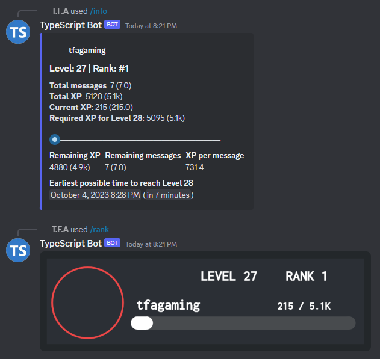

 <h3 align="center">Destinator — Advanced Leveling Bot for Discord</h3> 

Destinator Bot (Alpha v0.2.0)
Destinator is a powerful open-source Discord leveling bot built with discord.js v14. It features a sleek, image-based rank system, uses a custom canvas engine, and is designed to be fully functional without limitations or subscriptions.

✨ Key Features
📈 XP-based user leveling system.

🏅 Unlimited XP-based role rewards.

🛠️ Admin commands like /give-xp, /remove-xp, /import.

🖼️ Stylish rank cards with automatic XP tracking.

⚙️ Fully command-based configuration—no website or dashboard needed.

🗂️ Multi-guild support out of the box.

📋 Error logging directly into the database for later fixes.

📸 Preview
   
🧮 XP Leveling Formula
Destinator uses a customizable XP formula:

ts
Copy
Edit
ƒ(x) = base * (x²) + coefficient * x + constant
Default values:

ini
Copy
Edit
base = 5
coefficient = 50
constant = 100
Where x is the user's current level.

💬 Custom Level-Up Message
Customize level-up messages with dynamic placeholders:

{user} – mentions the user

{userId} – user's Discord ID

{username} – user's username

{level} – new level achieved

Example:

bash
Copy
Edit
/config set configuration: "Set custom level up message" string: "GG {user}, you've reached level {level}!"
🔄 XP Importing
Destinator supports XP import from public APIs using guild IDs. You can use /import to pull XP data from external sources if publicly visible.

🧰 Tech Stack
discord.js v14

@napi-rs/canvas

Prisma ORM with SQLite (or switch to PostgreSQL/MongoDB)

Custom patched canvacord (built-in)

TypeScript

📖 License
This project is open-source and free to use under the MIT License.
